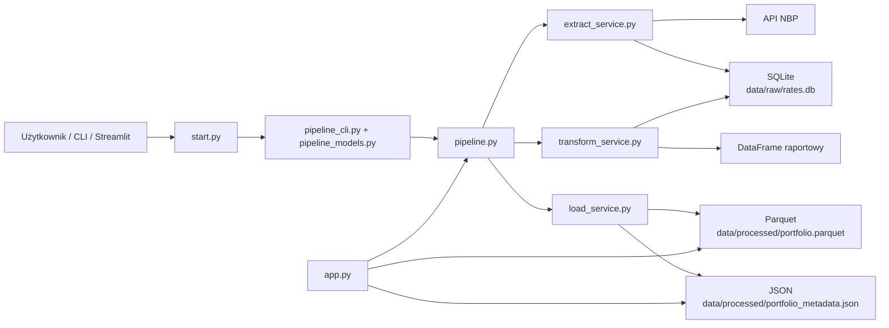

# Dokumentacja projektu

## 1. Cel projektu

Projekt automatyzuje analizę inwestycji w 3 waluty na podstawie średnich kursów NBP.

System:

- przyjmuje parametry wejściowe: kwota, data startu, liczba dni oraz alokacja walut,
- pobiera kursy z API NBP,
- zapisuje dane źródłowe do lokalnej bazy SQLite,
- buduje dzienny szereg wycen portfela,
- zapisuje wynik do formatu Parquet oraz metadanych JSON,
- prezentuje rezultat w dashboardzie Streamlit.

Rozwiązanie zostało zaprojektowane jako mini-pipeline danych z wyraźnym podziałem odpowiedzialności między warstwami.

## 2. Widok architektury



## 3. Główny przepływ danych

### 3.1 Scenariusz standardowy

1. Użytkownik uruchamia `start.py` albo `run_pipeline.py`.
2. Argumenty są parsowane przez `pipeline_cli.py`.
3. Parametry biznesowe są walidowane przez `pipeline_models.py`.
4. `pipeline.py` uruchamia kolejne etapy:
   - extract,
   - transform,
   - load.
5. `extract_service.py` pobiera dane z NBP i zapisuje je do SQLite.
6. `transform_service.py` czyta dane z SQLite, buduje dzienny kalendarz i liczy portfel.
7. `load_service.py` zapisuje wynik do Parquet i metadanych JSON.
8. `app.py` odczytuje artefakty albo uruchamia pipeline z poziomu dashboardu.

### 3.2 Scenariusz dashboard-only

1. Użytkownik uruchamia `python start.py --skip-pipeline`.
2. `start.py` pomija ETL.
3. Streamlit startuje i `app.py` próbuje odczytać istniejące artefakty:
   - `portfolio.parquet`,
   - `portfolio_metadata.json`.

### 3.3 Scenariusz fallback

1. `extract_service.py` próbuje pobrać dane z API NBP.
2. Jeśli API zwróci błąd sieciowy lub brak danych, system sprawdza lokalną SQLite.
3. Jeśli baza ma wystarczający zakres danych, pipeline kontynuuje pracę na cache lokalnym.
4. Jeśli baza nie ma danych, pipeline kończy się kontrolowanym błędem.

## 4. Odpowiedzialność plików

### 4.1 Pliki startowe

#### `start.py`

Główny punkt wejścia dla całego projektu.

Odpowiada za:

- uruchomienie pełnego pipeline,
- opcjonalne pominięcie ETL przez `--skip-pipeline`,
- start dashboardu Streamlit,
- przekazanie parametrów CLI do warstwy pipeline.

#### `run_pipeline.py`

Lekki orchestrator CLI dla samego ETL.

Odpowiada za:

- uruchomienie `extract -> transform -> load`,
- logowanie lokalizacji artefaktów po zakończeniu przebiegu.

#### `app.py`

Warstwa prezentacji i interakcji z użytkownikiem.

Odpowiada za:

- formularz wejścia w sidebarze,
- uruchamianie pipeline z poziomu UI,
- odczyt gotowych artefaktów,
- rysowanie wykresów i tabel,
- kontrolowaną obsługę błędów po stronie frontendowej.

### 4.2 Warstwa konfiguracji i walidacji

#### `src/config.py`

Centralna konfiguracja techniczna projektu.

Zawiera:

- ścieżki do katalogów i artefaktów,
- konfigurację API NBP,
- domyślne wartości biznesowe,
- listę obsługiwanych walut,
- kolory wykresów,
- logger projektu.

#### `src/pipeline_models.py`

Model parametrów pipeline.

Zawiera:

- `PipelineParameters`,
- `ConfigurationError`,
- walidację wejścia,
- obliczane pola pochodne, np. `end_date`, `buffer_start_date`,
- serializację parametrów do metadanych.

#### `src/pipeline_cli.py`

Warstwa parsowania argumentów CLI.

Odpowiada za:

- `--amount`,
- `--start-date`,
- `--holding-period-days`,
- `--allocations`.

Ta warstwa zamienia surowe argumenty z konsoli na obiekt `PipelineParameters`.

### 4.3 Warstwa extract

#### `src/01_extract_api.py`

Skrypt etapowy uruchamiający tylko extract.

#### `src/extract_service.py`

Serwis pobierania i zapisu danych źródłowych.

Odpowiada za:

- inicjalizację schematu SQLite,
- budowę sesji HTTP z retry,
- dzielenie dużych zakresów dat na chunki zgodne z API NBP,
- pobieranie danych z API,
- idempotentny zapis do SQLite,
- fallback do lokalnej bazy danych.

### 4.4 Warstwa transform

#### `src/02_transform.py`

Skrypt etapowy uruchamiający tylko transform.

#### `src/transform_service.py`

Serwis budowy raportu portfela.

Odpowiada za:

- odczyt kursów z SQLite,
- pivot `date x currency`,
- budowę pełnego kalendarza dziennego,
- `forward-fill` dla weekendów i świąt,
- wyliczenie jednostek kupionych na `Day 0`,
- wyliczenie wartości portfela dzień po dniu,
- wyliczenie zmian dziennych i narastających.

### 4.5 Warstwa load

#### `src/03_load_cloud.py`

Skrypt etapowy uruchamiający tylko load.

#### `src/load_service.py`

Serwis zapisu i odczytu artefaktów analitycznych.

Odpowiada za:

- zbudowanie metadanych uruchomienia,
- zapis raportu do Parquet,
- zapis metadanych do JSON,
- odczyt gotowych artefaktów.

### 4.6 Warstwa orkiestracji

#### `src/pipeline.py`

Główna warstwa spinająca etapy biznesowe.

Odpowiada za:

- wywołanie `extract_rates`,
- wywołanie `build_portfolio_report`,
- wywołanie `save_processed_data`,
- zbudowanie `PipelineRunResult`,
- odczyt istniejących artefaktów i walidację ich spójności.

## 5. Jak komponenty się komunikują

Projekt komunikuje się przez cztery typy interfejsów.

### 5.1 Komunikacja HTTP

Kierunek:

- `extract_service.py` -> `API NBP`

Cel:

- pobranie średnich kursów walut po zakresie dat.

Mechanizmy:

- `requests.Session`,
- retry dla błędów tymczasowych,
- timeout,
- odpowiedzi JSON.

### 5.2 Komunikacja z bazą danych

Kierunek:

- `extract_service.py` -> SQLite,
- `transform_service.py` -> SQLite.

Cel:

- oddzielenie danych źródłowych od logiki obliczeniowej,
- możliwość ponownego wykorzystania danych bez ponownego uderzania do API.

Mechanizmy:

- `sqlite3`,
- zapytania parametryzowane,
- `ON CONFLICT DO UPDATE`.

### 5.3 Komunikacja plikowa

Kierunek:

- `load_service.py` -> Parquet i JSON,
- `app.py` -> Parquet i JSON.

Cel:

- zapis gotowego modelu analitycznego,
- odczyt wyników przez dashboard.

Artefakty:

- `data/processed/portfolio.parquet`,
- `data/processed/portfolio_metadata.json`.

### 5.4 Komunikacja procesowa

Kierunek:

- `start.py` -> subprocess `streamlit run app.py`

Cel:

- uruchomienie UI po zakończeniu ETL.

## 6. Kontrakty danych

### 6.1 Kontrakt wejścia: `PipelineParameters`

Obiekt zawiera:

- `investment_amount_pln`,
- `start_date`,
- `holding_period_days`,
- `allocations`.

Walidacje:

- kwota > 0,
- liczba dni > 0,
- dokładnie 3 różne waluty,
- suma wag = 100%,
- tylko obsługiwane waluty,
- data końcowa nie może być w przyszłości.

### 6.2 Kontrakt SQLite

Tabela:

`exchange_rates`

Kolumny:

- `date`,
- `currency`,
- `rate`,
- `table_name`,
- `bulletin_no`,
- `fetched_at`.

Klucz logiczny:

- `(date, currency)`

Znaczenie:

- `date` — data publikacji kursu przez NBP,
- `currency` — kod waluty,
- `rate` — kurs średni,
- `table_name` — tabela NBP,
- `bulletin_no` — numer publikacji,
- `fetched_at` — czas pobrania.

### 6.3 Kontrakt Parquet

Przykładowe kolumny raportu:

- `day_number`,
- `total_value_pln`,
- `daily_change_pln`,
- `cumulative_change_pln`,
- `daily_return_pct`,
- `cumulative_return_pct`,
- `USD_rate`, `EUR_rate`, `HUF_rate`,
- `USD_units`, `EUR_units`, `HUF_units`,
- `USD_value_pln`, `EUR_value_pln`, `HUF_value_pln`.

Indeks:

- `valuation_date`

### 6.4 Kontrakt JSON

Plik metadanych zawiera:

- parametry wejścia,
- liczbę wierszy raportu,
- daty startu i końca,
- wartość startową i końcową,
- zysk/stratę,
- kursy zakupu,
- liczbę kupionych jednostek,
- informacje, które waluty zostały odświeżone z API, a które wzięte z cache.

## 7. Logika biznesowa

### Zakup walut

Waluty są kupowane tylko raz, w dacie startu inwestycji.

Wzór:

`kupione_jednostki = (kwota_inwestycji * udział_waluty) / kurs_zakupu`

### Wycena dzienna

Każdego dnia wartość waluty liczona jest jako:

`wartość_waluty_dzień = kupione_jednostki * kurs_dzień`

Łączna wartość portfela:

`wartość_portfela = suma wartości wszystkich 3 walut`

### Weekend i święta

Jeśli w danym dniu nie ma publikacji NBP:

- system bierze ostatni dostępny kurs z poprzedniego dnia roboczego,
- robi to przez `forward-fill` na dziennym kalendarzu.

## 8. Kolejność wywołań w kodzie

### Start przez `start.py`

1. `parse_startup_arguments`
2. `parse_pipeline_parameters`
3. `run_pipeline`
4. `launch_streamlit`

### Wewnątrz `run_pipeline`

1. `extract_rates`
2. `build_portfolio_report`
3. `build_run_metadata`
4. `save_processed_data`
5. zwrot `PipelineRunResult`

### Wewnątrz `build_portfolio_report`

1. `read_rates_from_db`
2. `build_daily_rate_frame`
3. `calculate_portfolio`

## 9. Obsługa błędów

Projekt nie zakłada, że wszystko zawsze zadziała.

Zabezpieczenia:

- walidacja parametrów przed startem pipeline,
- retry i timeout dla API,
- fallback do SQLite, gdy API chwilowo nie działa,
- kontrolowane błędy przy brakujących danych,
- walidacja spójności zapisanych artefaktów,
- bezpieczne komunikaty w dashboardzie zamiast surowego tracebacku dla użytkownika.

## 10. Testy

Testy znajdują się w katalogu `tests/`.

Pokrywają między innymi:

- walidację parametrów,
- dzielenie zakresów dat na chunki,
- idempotentny zapis do SQLite,
- fallback do lokalnego cache,
- budowę 31-dniowego szeregu z weekendami,
- roundtrip zapisu Parquet/JSON.

Uruchomienie:

```bash
python -m unittest discover -s tests -v
```

## 11. Najważniejsze zależności między plikami

Najprostszy sposób myślenia o projekcie:

- `start.py` i `run_pipeline.py` sterują,
- `pipeline_cli.py` i `pipeline_models.py` walidują wejście,
- `extract_service.py` zbiera dane i zapisuje surowe rekordy,
- `transform_service.py` buduje raport analityczny,
- `load_service.py` zapisuje wynik,
- `pipeline.py` łączy wszystko w jeden przebieg,
- `app.py` pokazuje wynik użytkownikowi.

Centralny łańcuch odpowiedzialności:

`Użytkownik -> start.py -> pipeline.py -> extract/transform/load -> artifacts -> app.py`
